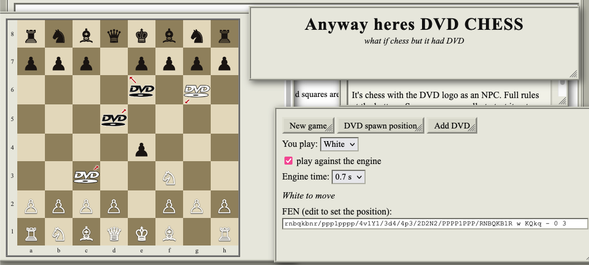

# dvd-chess

It's chess but it has DVD



[play it online at https://jon-e.net/dvd-chess](https://jon-e.net/dvd-chess)

## How DVD works

- DVD may not go in the corners.
- Get DVD by promoting a pawn in any file except A and H (or, in the demo, just click Add DVD). NO CORNERS.
- DVD changes colors every other turn, unless moved
- DVD moves diagonally. After every turn, DVD moves one square diagonally on its current trajectory.
- DVD is not under player control unless it is on a side
- When DVD hits a side, it bounces off unless moved
- When DVD is on a side, if it is your color, you can move DVD one square along the side, except the corner. DVD may not capture when moved sideways. Moving DVD delays its color change by one turn. Moving DVD takes the players turn.
- Moving DVD affects its diagonal direction: e.g. if DVD was on A5 and moved to A6, it will proceed to B7. If it was moved to A4, it will proceed to B3.
- When DVD encounters another piece while moving diagonally, it captures it if it is the opposite color, and is stuck and waits if the same color. When color flips, it continues along the same course, capturing.
- DVD may be captured like a normal piece.
- DVD cannot give check, and kings are bumpers.

Edge case rules:
- this should only be possible with manual spawns, but if the DVD is on the center diagonal and would enter the corner squares, rather than just bouncing back and forth forever, it turns left or right based off some arbitrary random numbers.
      
## FEN notation

DVD is represented by four pieces depending on the direction of movement from the perspective of white.

- d - northeast
- v - northwest
- w - southeast
- y - southwest


## Variant config      

to play dvd chess with the fairy stockfish fork, use the following [variant config](./src/dvdchess.ini)

```ini
[dvdchess:chess]
customPiece1 = d:
customPiece2 = v:
customPiece3 = w:
customPiece4 = y:
dvdChess = true
pieceValueMg = d:200 v:200 w:200 y:200
pieceValueEg = d:200 v:200 w:200 y:200
```

## Implementation notes

IDK i'm pretty bad at C, so i just copied and pasted other stuff i saw until it worked, and i used the brute force machines to get the wasm stuff building because i only care about DVD not about how wasm works.

I didn't want to figure out how to make DVD expressible normally as one piece, so instead it's 4. The two nonstandard things about DVD are a) it moves on its own, and b) it flips color every other turn. Thankfully, some of the variants here already had behavior like that, like the reversi variant for flipping colors.

Apparently all the piece movement logic is done in some gigantic 700 line function "do_move" so that's where most of the stuff is. stuff is way easier if the move can be fully determined by the state of the board without having to consider history (like remembering how many turns DVD has been a color), so we sort of fake the "flip color every other turn" by flipping colors after black's turn.

I'm not really sure if i gave stockfish all the info it needs to simulate the DVD moves, the only player-driven move is the movement along the sides, so i added that to its move generation function, but wasn't really sure how to tell it about like "yeah but there is a DVD piece that is not controlled by a player and will also be moving and you need to get out of its way." I didn't spend a lot of time learning about stockfish internals, just enough to get it to generate DVD moves, so if there is some better way to tell the CPU how to play better against DVD just hmu.

stockfish should technically be capable of promoting into DVD, but i haven't seen it do it. if you increase the piece value of DVD it probably would encourage the CPU to promote into it, but then it also turns it into a relentless DVD hunting machine so that's less fun. i kept them at low values but you can mess around with it in the JS if you want.

## Building

You can build it [like normal](https://github.com/fairy-stockfish/Fairy-Stockfish/wiki/Compiling-Fairy-Stockfish) but some custom stuff to build to wasm here.

Requires **Emscripten** (`emcc`). Install via [emsdk](https://emscripten.org/docs/getting_started/downloads.html);


```sh
cd src
make -f Makefile_js build es6=yes
cp tests/js/ffish.js tests/js/ffish.wasm ../docs/
```

to make it work on crappy github pages, had to make it single threaded and set a fixed memory to make it work on firefox. and some other compatibility stuff that i just sort of copy/pasted my way through. idk this is not a tech demo this is DVD chess.


## Sources

This is a fork of [fairy stockfish](https://github.com/fairy-stockfish/Fairy-Stockfish) and all credit goes to them and also the regular stockfish people for the real work. that code is distributed as GPL-3, so this code is too.
